# Sistem Sinkronisasi SMK TTN — Diagram Arsitektur

> Visualisasi alur sinkronisasi antara SQLite (lokal) dan Firebase Firestore (cloud).
> Render otomatis di GitHub, VSCode Preview, dan HTML viewer (lihat `architecture.html`).

---

## 1. Big Picture — Arsitektur Tinggi

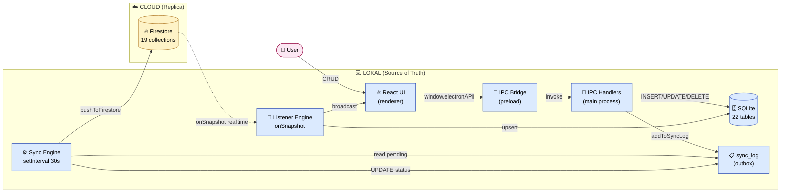

**Prinsip**: SQLite = source of truth, Firestore = replica. Selalu operasi di local dulu, sync engine yang handle bolak-balik.

---

## 2. Outbox Pattern — Buku Pesanan

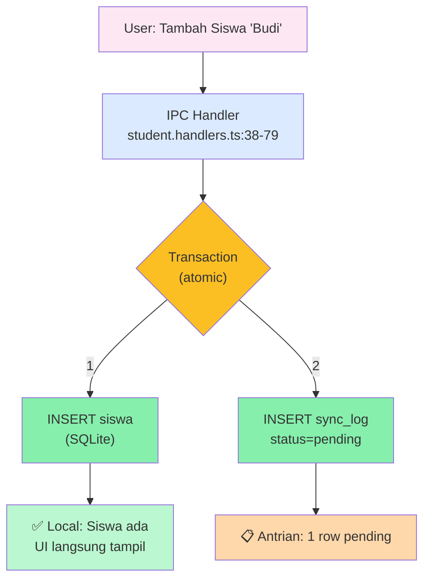

**Kenapa outbox?**
- ✅ **Atomic**: insert data + catat antrian dalam 1 transaksi — kalau crash, no half-state
- ✅ **Resilient**: app crash? sync_log masih ada → di-retry saat restart
- ✅ **Idempotent**: UNIQUE constraint di sync_log → no duplicate entries

---

## 3. Push Flow (Local → Cloud) — Setiap 30 Detik

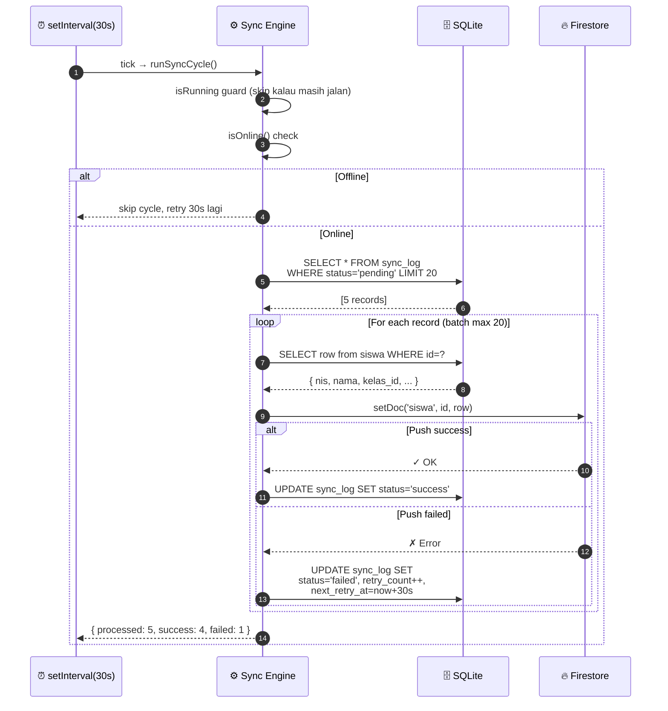

**Retry strategy** (exponential backoff):
```
Retry 1: 30 detik
Retry 2: 1 menit
Retry 3: 2 menit
Retry 4: 4 menit
Retry 5: 8 menit
         ↓
    dead_letter (perlu manual)
```

---

## 4. Real-time Listener (Cloud → Local) — Push dari Device Lain

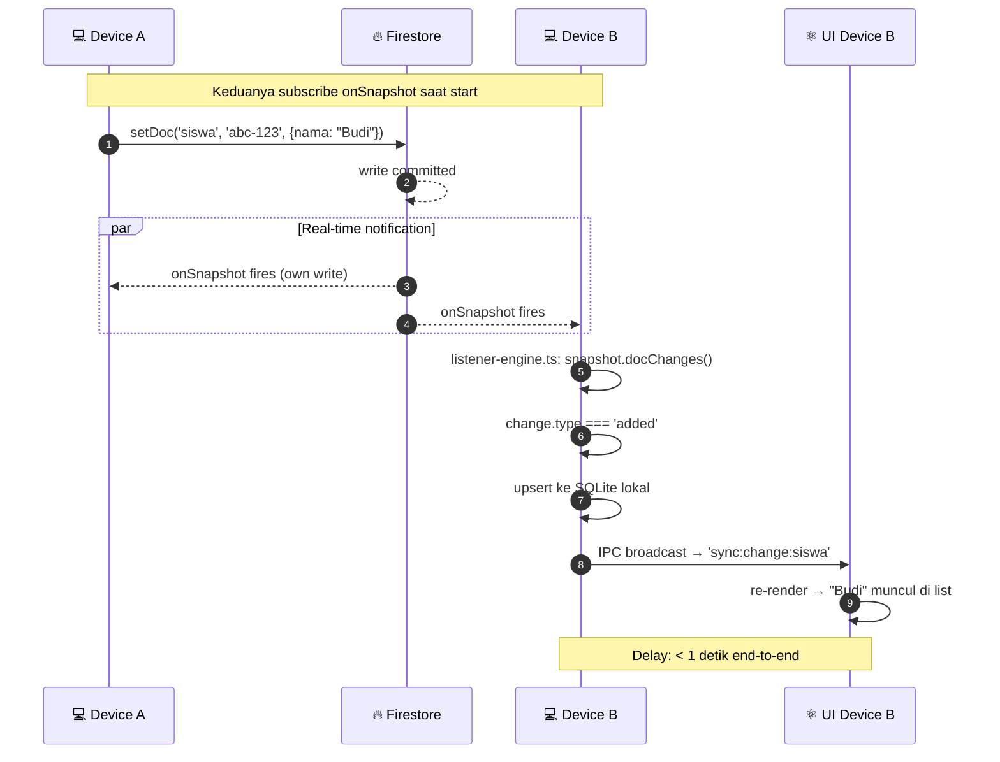

**Cost**: 22 onSnapshot subscriptions = 22 reads saat initial subscribe, lalu 1 read per perubahan.

---

## 5. Pull on Startup — Recovery saat Buka App

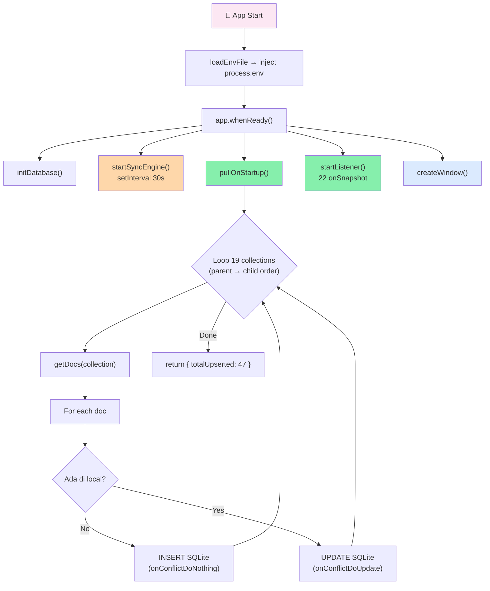

**Kapan dipakai?**
- Device baru di-install → pull data existing dari cloud
- Multi-device setup → catch up dengan perubahan dari device lain
- Restore after crash → recover missed changes

---

## 6. Tambah Siswa — Full End-to-End Scenario

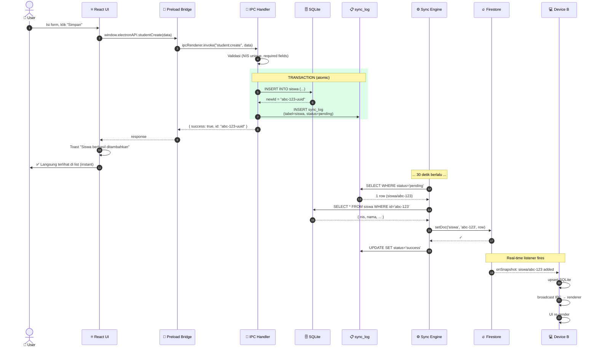

**Total delay**: 0-30 detik untuk sampai ke cloud, < 1 detik dari cloud ke device lain.

---

## 7. Sync Engine State Machine

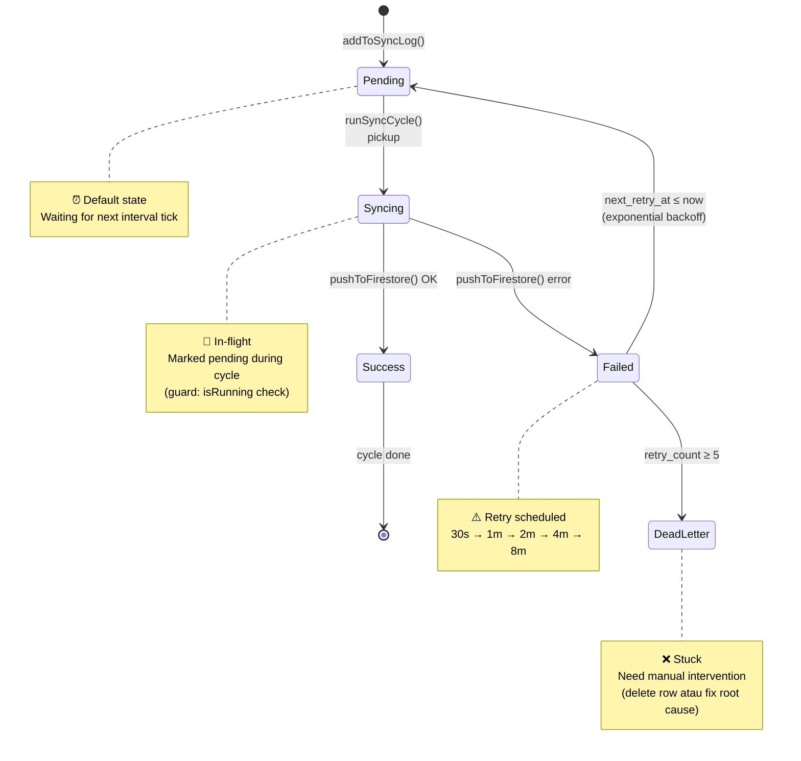

---

## 8. Tabel yang Di-Sync

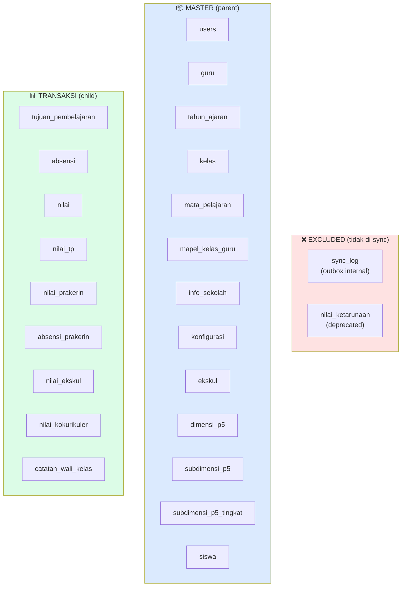

**22 syncable** (1 deprecated + 1 outbox excluded) → **20 collection** di Firestore.

---

## 9. Cost & Quota

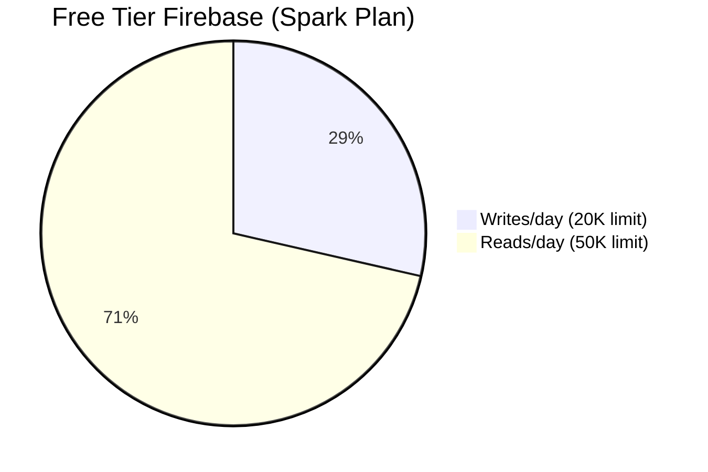

**Per demo session (~1-2 jam)**:
| Action | Writes | Reads |
|---|---|---|
| Tambah 1 siswa via UI | 1 | 0 |
| Tambah 1 nilai | 1 | 0 |
| Listener subscribe 22 collection (start) | 0 | 22 |
| Real-time update dari device lain | 0 | 1-5 |
| **Total demo** | **~20-50** | **~100-200** |

**Sangat hemat** — pakai < 1% free tier.

---

## 10. Recovery — Apa yang Terjadi Saat Crash?

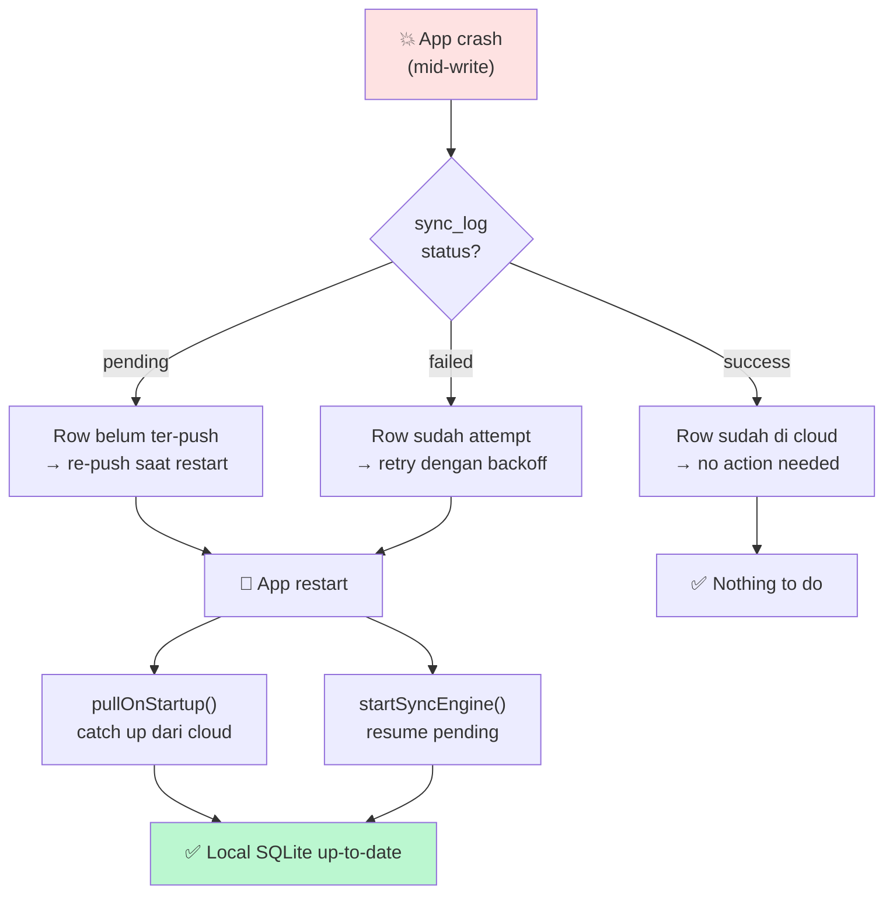

**Outbox pattern** = no data loss. Kalau crash saat push, sync_log masih `pending` → di-retry.

---

## 📁 File yang Berkaitan

| File | Baris | Fungsi |
|---|---|---|
| `src/lib/sync/sync-queue.ts` | 26 | Outbox pattern (`addToSyncLog`) |
| `src/lib/sync/sync-engine.ts` | 623 | Main loop, batch, retry |
| `src/lib/sync/firebase-config.ts` | 215 | Init, push, delete Firestore |
| `src/lib/sync/listener-engine.ts` | 145 | Real-time onSnapshot |
| `src/lib/sync/config-storage.ts` | 136 | Encrypted config (OS keychain) |
| `src/lib/sync/retry-strategy.ts` | 91 | Exponential backoff |

**Total**: 1.236 baris kode sync.

---

## 🎯 Key Takeaways (Visual)

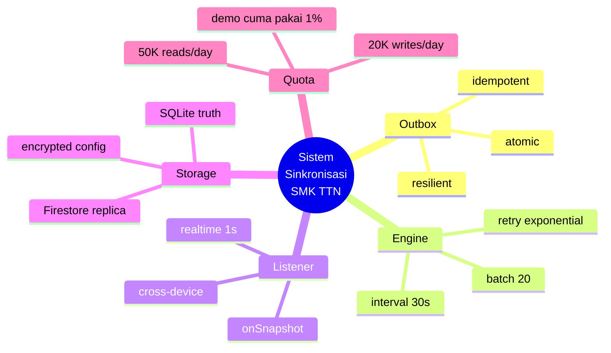

---

**Buka di browser**: `architecture.html` (di folder ini) untuk render interaktif dengan klik & zoom.
