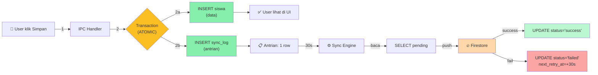
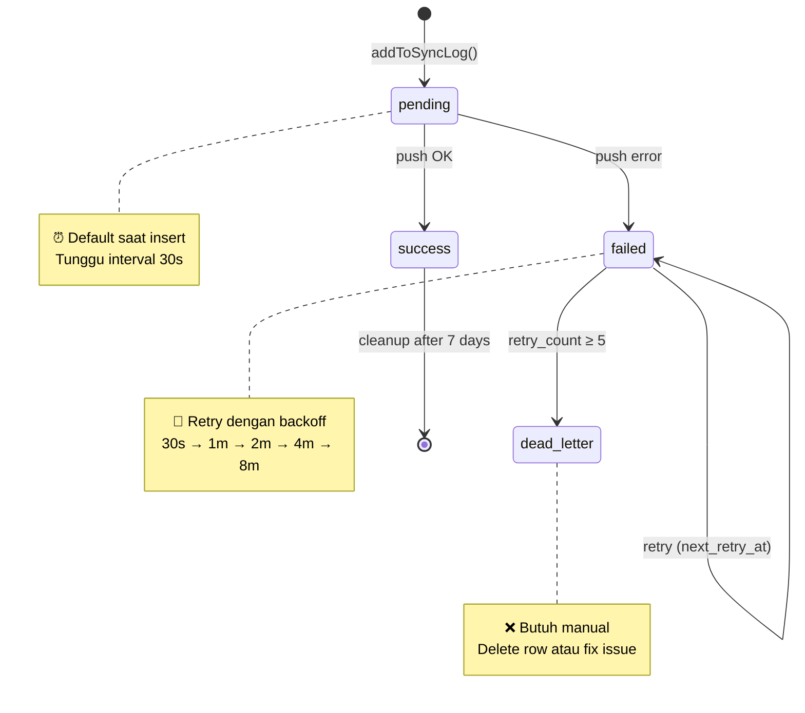

# sync_log — Tabel "Buku Pesanan" Sinkronisasi

> Deep-dive: apa itu `sync_log`, kenapa ada, bagaimana cara kerjanya, dan kenapa penting untuk reliability.

---

## 🤔 Masalah yang Diselesaikan

Bayangkan **tanpa `sync_log`**:

```typescript
// Hypothetical: langsung push setiap CRUD
ipcMain.handle("student:create", async (_, data) => {
  db.insert(siswa).values(data).run()  // ← SQLite OK

  // LANGSUNG push ke Firestore
  await pushToFirestore("siswa", row, id)  // ← apa kalau gagal?

  return result
})
```

**Apa yang salah?**
- ❌ Kalau push gagal (network down, quota, dll), data ada di SQLite tapi TIDAK di cloud
- ❌ Kalau app crash SEBELUM push complete, data hilang dari cloud
- ❌ Kalau user edit 2 record cepat → race condition di push
- ❌ Tidak ada cara retry yang reliable
- ❌ Tidak ada audit trail ("siapa yang push apa kapan?")

**Solusi: Outbox Pattern** = pisah "tulis data" dengan "kirim ke cloud", pakai `sync_log` sebagai antrian.

---

## 📋 Anatomi sync_log

```sql
CREATE TABLE sync_log (
  id            TEXT PRIMARY KEY,            -- UUID
  tabel         TEXT NOT NULL,               -- "siswa", "nilai", dll
  record_id     TEXT NOT NULL,               -- UUID row yang berubah
  action        TEXT NOT NULL,               -- 'insert' | 'update' | 'delete'
  status        TEXT NOT NULL,               -- 'pending' | 'success' | 'failed' | 'dead_letter'
  synced_at     TEXT NOT NULL,               -- timestamp operasi
  retry_count   INTEGER NOT NULL DEFAULT 0,  -- berapa kali sudah retry
  next_retry_at TEXT,                        -- kapan coba lagi
  last_error    TEXT,                        -- pesan error terakhir
  updated_at    TEXT NOT NULL,               -- timestamp update terakhir
  -- Index untuk query yang sering:
  INDEX idx_sync_log_status_synced_at (status, synced_at)
  INDEX idx_sync_log_status_next_retry (status, next_retry_at)
);
```

Lokasi: `src/lib/db/schema.ts` (tabel ke-22, internal).

---

## 🔄 Visualisasi Outbox Pattern



**Step 2a & 2b terjadi dalam 1 transaction** — atomic. Kalau salah satu gagal, keduanya di-rollback.

---

## 🛠️ Bagaimana Cara Kerjanya — 3 Phase

### Phase 1: INSERT (saat user CRUD)

```typescript
// src/lib/sync/sync-queue.ts (26 baris — simple!)
export function addToSyncLog(tabel, recordId, action) {
  const db = getDb()
  db.insert(syncLog).values({
    tabel,                // "siswa"
    record_id,            // "abc-123-uuid"
    action,               // "insert"
    synced_at: new Date().toISOString(),
    status: "pending",    // ← selalu pending saat insert
    retry_count: 0,
  }).run()
}
```

**Dipanggil dari setiap IPC handler**:

```typescript
// electron/ipc/student.handlers.ts:38-79
ipcMain.handle("student:create", async (_, data) => {
  // 1. Validate
  // 2. INSERT siswa (dalam transaction)
  const result = db.transaction(() => {
    const row = db.insert(siswa).values(data).returning().get()
    addToSyncLog("siswa", row.id, "insert")  // ← 2a
    return row
  })
  return result
})
```

### Phase 2: PROCESS (setiap 30 detik)

```typescript
// src/lib/sync/sync-engine.ts:271-284
const records = db.select().from(syncLog)
  .where(or(
    eq(syncLog.status, "pending"),
    and(
      eq(syncLog.status, "failed"),
      lte(syncLog.next_retry_at, now)  // yang sudah waktunya retry
    )
  ))
  .limit(BATCH_SIZE)  // 20
  .all()
```

Engine cuma pilih:
- Yang `pending` (belum pernah diproses)
- Yang `failed` tapi `next_retry_at` sudah lewat

### Phase 3: COMPLETE (setelah push selesai)

```typescript
// Success case
db.update(syncLog)
  .set({ status: "success", synced_at: new Date().toISOString() })
  .where(eq(syncLog.id, record.id))
  .run()

// Failed case
const decision = getRetryDecision(record.retry_count)
// decision: { nextStatus: "failed", retryCount: +1, nextRetryAt: +30s }
db.update(syncLog)
  .set({
    status: decision.nextStatus,
    retry_count: decision.retryCount,
    next_retry_at: decision.nextRetryAt,
    last_error: "Firestore error message..."
  })
  .where(eq(syncLog.id, record.id))
  .run()
```

---

## 🛡️ Kenapa Outbox Pattern Penting? — 6 Alasan

### 1. **Atomicity** (no half-state)

```typescript
db.transaction(() => {
  db.insert(siswa).values(data).run()    // ← harus sukses
  addToSyncLog("siswa", id, "insert")    // ← harus sukses
  // Kalau ada yang gagal, semua rollback
})
```

Tanpa transaction: bisa ada siswa di SQLite tapi TIDAK ada di sync_log → data tidak pernah ter-sync.

### 2. **Crash Recovery** (no data loss)

```
T+0   : User tambah siswa "Budi"
T+0.1 : SQLite updated ✓
T+0.1 : sync_log pending ✓
T+0.2 : APP CRASH 💥 (sebelum 30s)

(restart)
T+10  : startSyncEngine()
T+10  : pullOnStartup() — catch up from cloud
T+10  : SELECT pending from sync_log → ada "siswa/Budi"
T+40  : runSyncCycle() → push "Budi" → ✓
```

**Tanpa sync_log**: "Budi" ada di SQLite lokal, TIDAK di cloud. Kalau user install ulang, "Budi" hilang.

### 3. **Retry yang Reliable**

```typescript
// Tanpa sync_log: retry cuma 1x saat handler jalan
try { await pushToFirestore(...) } catch { /* lost */ }

// Dengan sync_log: retry persistent
if (failed) {
  status = "failed"
  next_retry_at = now + 30s
  // 30s kemudian di-pickup lagi
}
```

### 4. **Idempotency** (aman double-push)

```typescript
// Misal: app restart 2x, sync_log punya 2 entry untuk row yang sama
// Engine proses keduanya:
//   1. push "siswa/abc" → Firestore setDoc (overwrite, no duplicate)
//   2. push "siswa/abc" → Firestore setDoc (overwrite, OK lagi)
// Hasil: 1 doc di Firestore, sync_log marked success
```

Karena **Doc ID di Firestore = SQLite UUID** (deterministic), double-push aman.

### 5. **Audit Trail**

```sql
-- Bisa query: "Kapan 'Budi' ditambah?"
SELECT * FROM sync_log
WHERE record_id = 'abc-123-uuid'
ORDER BY synced_at;

-- Hasil:
-- 2026-07-17 14:30:00 | siswa | abc-123 | insert | success
```

Berguna untuk debug, compliance, audit.

### 6. **Quota Management**

```typescript
// Tanpa sync_log: user spam CRUD → Firestore kena rate limit
// 100 siswa ditambah dalam 10 detik = 100 Firestore writes langsung

// Dengan sync_log: di-batch 20 per cycle
SELECT pending LIMIT 20  // 20 writes per 30s
// 100 siswa = 5 cycle = 2.5 menit (smooth)
```

---

## 📊 Lifecycle sync_log Row



---

## 🔍 Contoh Query sync_log

### Lihat antrian saat ini

```sql
SELECT tabel, action, status, COUNT(*) as total
FROM sync_log
GROUP BY tabel, action, status
ORDER BY total DESC;
```

### Pending records (belum sync)

```sql
SELECT * FROM sync_log
WHERE status = 'pending'
ORDER BY synced_at ASC;
```

### Failed records (perlu investigasi)

```sql
SELECT tabel, record_id, retry_count, last_error, next_retry_at
FROM sync_log
WHERE status = 'failed'
ORDER BY next_retry_at ASC;
```

### History sukses (audit)

```sql
SELECT tabel, action, COUNT(*) as total
FROM sync_log
WHERE status = 'success'
  AND synced_at > datetime('now', '-7 days')
GROUP BY tabel, action;
```

---

## 🛠️ Maintenance & Cleanup

### Cleanup sukses lama (> 7 hari)

```sql
DELETE FROM sync_log
WHERE status = 'success'
  AND synced_at < datetime('now', '-7 days');
```

### Reset dead_letter (manual retry)

```sql
-- Reset semua dead_letter jadi pending untuk re-attempt
UPDATE sync_log
SET status = 'pending', retry_count = 0, next_retry_at = NULL
WHERE status = 'dead_letter';
```

### Cek sync health

```sql
-- Overall stats
SELECT
  status,
  COUNT(*) as total,
  MIN(synced_at) as oldest,
  MAX(synced_at) as newest
FROM sync_log
GROUP BY status;
```

---

## 🔗 Relasi sync_log dengan Tabel Lain

```
sync_log                        Other Tables
─────────                       ─────────────
tabel = "siswa"        ←─────  siswa.id
record_id = "abc-123"          siswa.nama, nis, dll

tabel = "nilai"        ←─────  nilai.id
record_id = "def-456"          nilai.formatif, sumatif, dll

tabel = "absensi"      ←─────  absensi.id
record_id = "ghi-789"          absensi.status, tanggal, dll

(22 tabel syncable, masing-masing bisa muncul di sync_log)
```

**sync_log TIDAK punya foreign key** ke tabel lain — supaya delete row di tabel lain TIDAK auto-delete sync_log entry (history preserved untuk retry).

---

## ⚠️ Edge Cases

### Row dihapus dari tabel lokal

```typescript
// sync-engine.ts:339-341
const row = db.select().from(tableRef).where(eq(tableRef.id, recordId)).get()
if (!row) {
  // Row sudah dihapus lokal → treat as delete di cloud
  await deleteFromFirestore(record.tabel, recordId)
}
```

Kalau user delete row, tapi sync_log entry masih `pending insert` → engine detect row hilang, treat as delete.

### Tabel di-exclude (sync_log, nilai_ketarunaan)

```typescript
// sync-engine.ts:78
const EXCLUDED_TABLES = new Set(["sync_log", "nilai_ketarunaan"])

// sync-engine.ts:299-306
if (EXCLUDED_TABLES.has(record.tabel)) {
  // Tabel internal → langsung mark success (skip Firestore)
  markSuccess(record)
  continue
}
```

`sync_log` TIDAK di-sync ke Firestore (infinite loop!).

### Multiple devices sync row yang sama

```
Device A: tambah siswa "Budi" → sync_log pending
Device B: tambah siswa "Budi" (NIS sama) → conflict

UNIQUE constraint: siswa.nis → Device B gagal insert
                  (NIS sudah ada di Device B lokal)
```

Conflict di-resolve di level application (validasi), bukan di sync engine.

---

## 📈 sync_log di Production (Demo)

**Normal state** (app jalan, user aktif):

| Status | Count (typical) |
|---|---|
| pending | 0-5 (langsung diproses) |
| success | ratusan/hari (history) |
| failed | 0-2 (sementara) |
| dead_letter | 0 (kalau tidak ada error sistemik) |

**Cara lihat di app**:
- Buka `/sync-status` → "Aktivitas Terakhir" (riwayat sync_log)
- Buka Firestore Console → verify data masuk

---

## 🎯 TL;DR

| Pertanyaan | Jawaban |
|---|---|
| **Apa itu sync_log?** | Tabel "buku pesanan" yang mencatat setiap perubahan lokal yang perlu di-sync |
| **Kenapa ada?** | Outbox pattern — pisah "tulis data" dengan "kirim ke cloud" untuk reliability |
| **Apa isinya?** | tabel, record_id, action, status, retry_count, next_retry_at |
| **Siapa yang isi?** | Setiap IPC handler setelah CRUD (`addToSyncLog()`) |
| **Siapa yang proses?** | Sync engine setiap 30 detik |
| **Kapan dihapus?** | Setelah status `success` + 7 hari (cleanup) |
| **Kenapa penting?** | Crash-safe, retry-able, idempotent, audit, quota-friendly |

> **Tanpa sync_log**: sinkronisasi fragile, race condition, no recovery
> **Dengan sync_log**: sinkronisasi reliable, no data loss, retry otomatis
